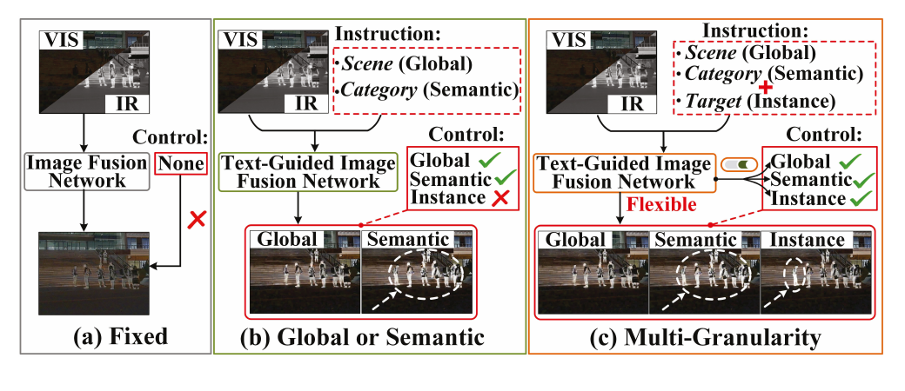
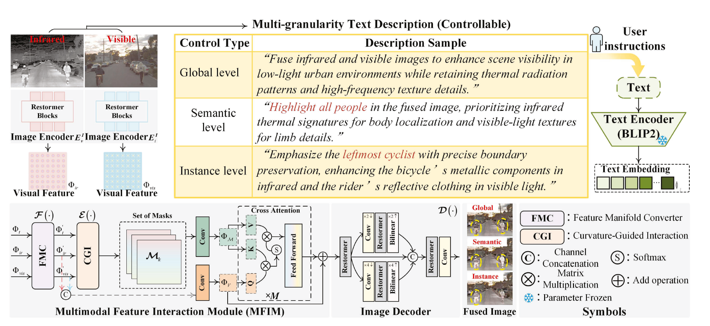

<div align="center">

# ControlFuse

### Instruction-guided Multi-Granularity Controllable Image Fusion

**Official PyTorch implementation of the AAAI 2026 paper**

[](https://ojs.aaai.org/index.php/AAAI/article/view/38321)


[Paper](https://ojs.aaai.org/index.php/AAAI/article/view/38321) ·
[Model Zoo](#model-zoo) ·
[Installation](#installation) ·
[Data Preparation](#data-preparation) ·
[Training](#training) ·
[Evaluation](#evaluation)

</div>

## Overview

ControlFuse is an instruction-guided infrared-visible image fusion framework that supports **global**, **semantic**, and **instance-level** control in a single model. Given the same registered infrared-visible pair, natural-language instructions determine which content should be emphasized and where the enhancement should occur.

This repository provides the model, multi-granularity data construction tools, training and inference pipelines, fusion-quality metrics, and control-localization evaluation.

<p align="center">
  
</p>
<p align="center"><em>Comparison of controllable IVIF fusion paradigms given the same VIS-IR inputs.</em></p>

## Framework

<p align="center">
  
</p>
<p align="center"><em>Overview of the proposed multi-granularity controllable fusion framework.</em></p>

## Highlights

- **Three control granularities.** One framework handles scene-level, category-level, and object-level instructions.
- **Unified multimodal interaction.** FMC projects visual and textual representations into a shared manifold space.
- **Fine-grained spatial alignment.** CGI uses curvature-aware interaction to connect instructions with spatial visual evidence.
- **Control-aware optimization.** Localization, boundary, same-class distractor, content-fidelity, and text-alignment objectives are jointly optimized.
- **Complete experiment pipeline.** The release covers data construction, training, inference, six fusion metrics, localization evaluation, and tests.

## Control Granularities

| Granularity | Example instruction | Expected behavior |
| --- | --- | --- |
| Global | *Enhance the entire scene.* | Fuse complementary information across the complete image. |
| Semantic | *Highlight all pedestrians.* | Emphasize all regions belonging to the requested category. |
| Instance | *Emphasize the leftmost pedestrian.* | Enhance only the specified object while suppressing same-class distractors. |

## Release Status

| Dataset | Data tool | Training config | Evaluation tool |
| --- | :---: | :---: | :---: |
| MSRS | ✓ | ✓ | ✓ |
| M3FD | ✓ | ✓ | ✓ |
| RoadScene | ✓ | ✓ | ✓ |

## Model Zoo

| Dataset | Model | Download |
| --- | --- | --- |
| MSRS | ControlFuse_MSRS | [Baidu Netdisk](https://pan.baidu.com/s/1gO1pnY19BiKmclZO05PtOQ?pwd=m6tf) |
| M3FD | ControlFuse_M3FD | [Baidu Netdisk](https://pan.baidu.com/s/1dQBJBdteVa5EdZBAnfCpgQ?pwd=vs8x) |
| RoadScene | ControlFuse_RoadScene | [Baidu Netdisk](https://pan.baidu.com/s/18php2c3WB1A9h9ZBCjlhow?pwd=uq2j |

## Installation

Python 3.10 or 3.11 is recommended.

~~~bash
git clone https://github.com/zhaolb4080/ControlFuse.git
cd ControlFuse

python -m venv .venv
source .venv/bin/activate
pip install -r requirements.txt
~~~

On Windows, activate the environment with:

~~~powershell
.venv\Scripts\activate
~~~

PyTorch 2.1–2.3 Windows wheels use the NumPy 1.x ABI. If the environment already contains NumPy 2.x:

~~~bash
pip uninstall -y numpy
pip install --no-cache-dir "numpy>=1.24,<2"
~~~

## Data Format

Each JSONL row represents one image-pair/instruction/mask sample:

~~~json
{"name":"00001_instance_3","visible":"images/00001.png","infrared":"infrared/00001.png","mask":"masks/00001_instance_3.png","instruction":"Emphasize the leftmost pedestrian.","negative_instruction":"Emphasize an absent car on the right.","granularity":"instance"}
~~~

## Data Preparation

Run all commands from the repository root and replace the example dataset and
checkpoint paths with local paths.

### MSRS

Expected layout: `train|test/{vi,ir,Segmentation_labels}`.

#### Training set

```bash
python tools/build_msrs_multigranularity.py \
  --split-root D:/Datasets/MSRS/train \
  --output data/msrs_train_control.jsonl \
  --min-instance-area 20 \
  --max-instances 5

python tools/build_manifest.py \
  --visible-dir D:/Datasets/MSRS/train/vi \
  --infrared-dir D:/Datasets/MSRS/train/ir \
  --output data/msrs_train_global.jsonl \
  --instruction "Enhance the entire scene." \
  --negative-instruction "Suppress the entire scene." \
  --granularity global
```

```bat
copy /b data\msrs_train_global.jsonl+data\msrs_train_control.jsonl data\msrs_train.jsonl
```

```bash
python tools/check_v5_data.py --manifest data/msrs_train.jsonl
```

#### Test set

```bash
python tools/build_msrs_multigranularity.py \
  --split-root D:/Datasets/MSRS/test \
  --output data/msrs_test_control.jsonl \
  --min-instance-area 20 \
  --max-instances 5

python tools/build_manifest.py \
  --visible-dir D:/Datasets/MSRS/test/vi \
  --infrared-dir D:/Datasets/MSRS/test/ir \
  --output data/msrs_test_global.jsonl \
  --instruction "Enhance the entire scene." \
  --negative-instruction "Suppress the entire scene." \
  --granularity global
```

```bash
python tools/check_v5_data.py --manifest data/msrs_test_control.jsonl
```

`msrs_test_global.jsonl` is used for global fusion metrics and
`msrs_test_control.jsonl` for semantic/instance localization. Instance masks
are obtained from 8-connected components of the semantic labels.

### M3FD

Expected layout: `M3FD/{Ir,Vis,Annotation}`. Split the 4,200 aligned pairs into
3,780 training pairs and 420 test pairs:

```bash
python tools/split_m3fd.py \
  --root D:/Datasets/M3FD \
  --train-count 3780 \
  --test-count 420 \
  --seed 2026
```

```bash
pip install git+https://github.com/facebookresearch/segment-anything.git
```

#### Training set

```bash
python tools/build_m3fd_multigranularity.py \
  --split-root D:/Datasets/M3FD/train \
  --output data/m3fd_train.jsonl \
  --sam-checkpoint D:/Weights/sam_vit_b_01ec64.pth \
  --sam-model-type vit_b \
  --device cuda \
  --sam-fallback error \
  --include-global \
  --min-instance-area 64 \
  --max-instances 5
```

```bash
python tools/check_v5_data.py --manifest data/m3fd_train.jsonl
```

#### Test set

```bash
python tools/build_m3fd_multigranularity.py \
  --split-root D:/Datasets/M3FD/test \
  --output data/m3fd_test_control.jsonl \
  --sam-checkpoint D:/Weights/sam_vit_b_01ec64.pth \
  --sam-model-type vit_b \
  --device cuda \
  --sam-fallback error \
  --min-instance-area 64 \
  --max-instances 5

python tools/build_manifest.py \
  --visible-dir D:/Datasets/M3FD/test/Vis \
  --infrared-dir D:/Datasets/M3FD/test/Ir \
  --output data/m3fd_test_global.jsonl \
  --instruction "Enhance the entire scene." \
  --negative-instruction "Suppress the entire scene." \
  --granularity global

python tools/check_v5_data.py --manifest data/m3fd_test_control.jsonl
```

M3FD XML boxes are converted into semantic and instance masks using SAM.
`m3fd_test_global.jsonl` and `m3fd_test_control.jsonl` are evaluated separately.

### RoadScene

Expected layout: `RoadScene/{infrared,visible}`. Split the 221 aligned pairs
into 171 training pairs and 50 test pairs:

```bash
python tools/split_roadscene.py \
  --root D:/Datasets/RoadScene \
  --train-count 171 \
  --test-count 50 \
  --seed 2026
```

Install SAM with the command given in the M3FD section. Grounding DINO is
loaded automatically through Transformers.

#### Training set

```bash
python tools/build_roadscene_multigranularity.py \
  --split-root D:/Datasets/RoadScene/train \
  --output data/roadscene_train.jsonl \
  --detector-model IDEA-Research/grounding-dino-base \
  --sam-checkpoint D:/Weights/sam_vit_b_01ec64.pth \
  --sam-model-type vit_b \
  --device cuda \
  --detect-infrared \
  --sam-fallback error \
  --include-global \
  --box-threshold 0.35 \
  --text-threshold 0.25 \
  --nms-iou 0.60 \
  --min-instance-area 64 \
  --max-instances 5
```

```bash
python tools/check_v5_data.py --manifest data/roadscene_train.jsonl
```

#### Test set

```bash
python tools/build_roadscene_multigranularity.py \
  --split-root D:/Datasets/RoadScene/test \
  --output data/roadscene_test_control.jsonl \
  --detector-model IDEA-Research/grounding-dino-base \
  --sam-checkpoint D:/Weights/sam_vit_b_01ec64.pth \
  --sam-model-type vit_b \
  --device cuda \
  --detect-infrared \
  --sam-fallback error \
  --box-threshold 0.35 \
  --text-threshold 0.25 \
  --nms-iou 0.60 \
  --min-instance-area 64 \
  --max-instances 5

python tools/build_manifest.py \
  --visible-dir D:/Datasets/RoadScene/test/visible \
  --infrared-dir D:/Datasets/RoadScene/test/infrared \
  --output data/roadscene_test_global.jsonl \
  --instruction "Enhance the entire scene." \
  --negative-instruction "Suppress the entire scene." \
  --granularity global

python tools/check_v5_data.py --manifest data/roadscene_test_control.jsonl
```

RoadScene has no annotations; Grounding DINO and SAM generate semantic/instance
pseudo-labels. Global metrics use `roadscene_test_global.jsonl`, while control
localization uses `roadscene_test_control.jsonl`.

## Training

~~~bash
python train.py --config configs/msrs.yaml
~~~

Resume an interrupted finite run:

~~~bash
python train.py \
  --config configs/msrs.yaml \
  --resume runs/controlfuse_msrs_v5/last.pt
~~~

## Inference

### Global fusion test

~~~bash
python infer_manifest.py \
  --config configs/msrs.yaml \
  --checkpoint runs/controlfuse_msrs_v5/last.pt \
  --manifest data/msrs_test_global.jsonl \
  --output-dir results/msrs_global_v5 \
  --batch-size 4
~~~

### Semantic and instance control test

~~~bash
python infer_manifest.py \
  --config configs/msrs.yaml \
  --checkpoint runs/controlfuse_msrs_v5/last.pt \
  --manifest data/msrs_test_control.jsonl \
  --output-dir results/msrs_control_v5 \
  --batch-size 4 \
  --save-masks
~~~

## Evaluation

### Global fusion quality

~~~bash
python evaluate.py \
  --manifest data/msrs_test_global.jsonl \
  --fused-dir results/msrs_global_v5 \
  --output results/msrs_global_metrics_v5.csv
~~~

`evaluate.py` reports EN, SD, SF, AG, VIF, and Qabf.

### Semantic and instance localization

~~~bash
python infer_manifest.py \
  --config configs/msrs.yaml \
  --checkpoint runs/controlfuse_msrs_v5/last.pt \
  --manifest data/msrs_test_control.jsonl \
  --output-dir results/msrs_control_v5 \
  --batch-size 4 \
  --save-masks

python evaluate_localization.py \
  --manifest data/msrs_test_control.jsonl \
  --predicted-dir results/msrs_control_v5/masks \
  --output results/msrs_localization_v5.csv \
  --summary results/msrs_localization_summary_v5.json \
  --threshold 0.5
~~~

The localization evaluator reports IoU, F1, precision, and recall for semantic and instance instructions separately.

## Repository Structure

~~~text
ControlFuse/
├── assets/                   # README teaser and framework figures
├── controlfuse/              # Model, data loader, losses, metrics, checkpoints
├── configs/                  # Generic, MSRS, M3FD, and smoke-test configs
├── tools/                    # Dataset builders, validators, and profiling
├── tests/                    # Smoke, data, and loss-behavior tests
├── train.py                  # Training entry point
├── infer.py                  # Single-pair inference
├── infer_manifest.py         # Batch inference
├── evaluate.py               # Six fusion-quality metrics
└──  evaluate_localization.py  # Semantic/instance localization metrics
~~~

## Citation

If ControlFuse is useful in your research, please cite:

~~~bibtex
@inproceedings{zhao2026controlfuse,
  title     = {ControlFuse: Instruction-guided Multi-Granularity Controllable Image Fusion},
  author    = {Zhao, Libo and Zhang, Xiaoli and Wang, Zeyu},
  booktitle = {Proceedings of the AAAI Conference on Artificial Intelligence},
  volume    = {40},
  number    = {16},
  pages     = {13199--13207},
  year      = {2026}
}
~~~
